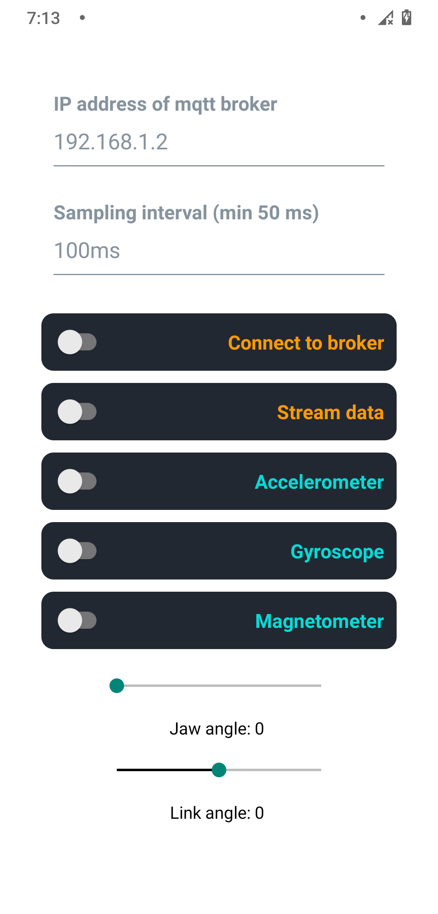

## Steps
* Install expo-cli
    * npm install -g expo-cli
* Clone repo
* Install packages  
    * npm install
* Download the Expo-Go app from the playstore/appstore on your phone.
* Run expo-start, which builds the app and returns a QR code
* Scan the QR code with the Expo-Go app, now the app will run on your .phone

## App-screen

